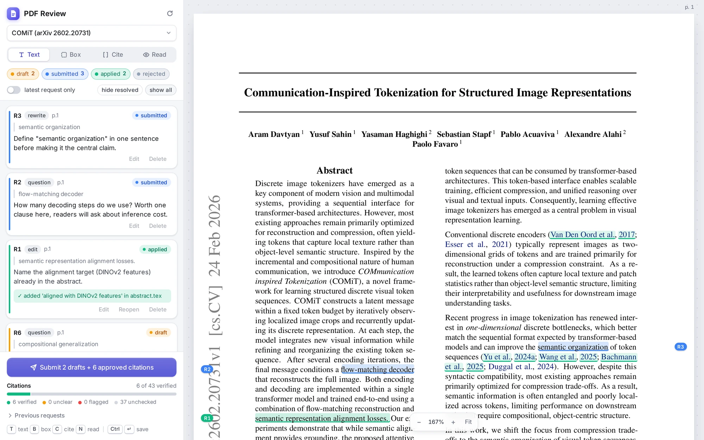
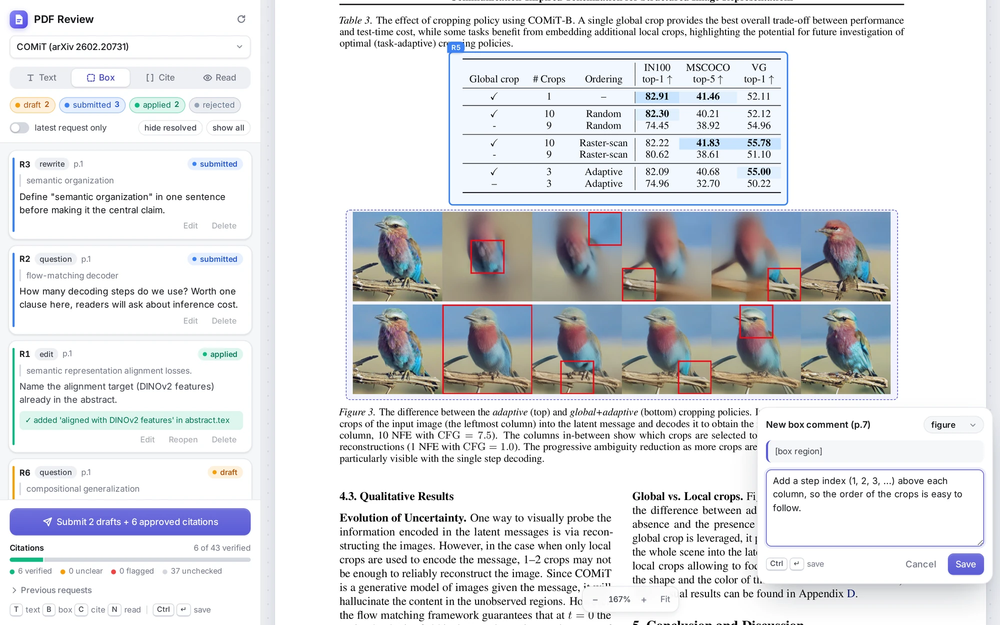
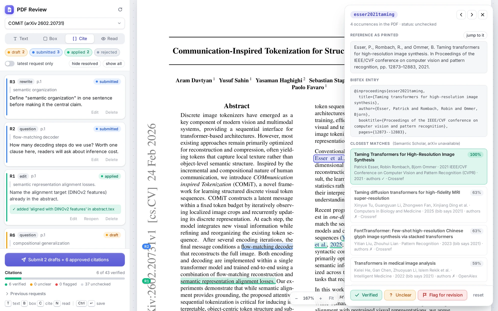

# PDF Review Tool

A small, dependency-free web tool for reviewing a PDF (e.g. a paper draft) in the browser.
You highlight text or draw boxes over figures and tables, attach comments, check citations, and
export everything as a *revision request*: a markdown file that an AI coding assistant (Claude Code
or similar) or a co-author can read and act on.

The server uses only the Python 3 standard library, and the viewer uses a vendored copy of
[pdf.js](https://mozilla.github.io/pdf.js/). There is nothing to install and no build step.

<picture>
  <source media="(prefers-color-scheme: dark)" srcset="docs/screenshots/overview-dark.webp">
  
</picture>

<sub>The screenshots show the arXiv preprint [<i>Communication-Inspired Tokenization for Structured Image
Representations</i>](https://arxiv.org/abs/2602.20731) (Davtyan et al., 2026,
[CC BY 4.0](https://creativecommons.org/licenses/by/4.0/)) with example review comments.</sub>

```
pdf_review/
  server.py        # HTTP server + CLI (serve / list / show / resolve)
  config.json      # which PDFs to offer and where their sources live
  static/          # viewer (index.html, app.js, style.css)
  vendor/          # pdf.js 4.10.38 and the Inter font, both with their licenses
  data/            # <pdf-id>.json  -- all comments for a PDF (auto-saved, git-ignored)
  requests/        # <pdf-id>/<timestamp>/revision_request.md + crop PNGs (git-ignored)
  docs/            # screenshots for this README
```

## Requirements

- Python 3 (standard library only)
- A recent Chrome, Firefox, Safari or Edge
- Internet access, only for the citation lookups in Cite mode

## Installation

Clone the tool into the root of your paper repository and name the folder `pdf_review`. The prompts
and revision requests it generates refer to `pdf_review/server.py`.

```bash
cd my-paper/
git clone https://github.com/Araachie/pdf_review_tool.git pdf_review
```

Then edit `pdf_review/config.json` so it points at your PDF (see [Configuration](#configuration)).

## Run

From the paper repository:

```bash
python3 pdf_review/server.py serve --open          # http://127.0.0.1:8765/
python3 pdf_review/server.py serve some/other.pdf  # add ad-hoc PDFs
```

If you work on a remote machine, forward the port with `ssh -L 8765:127.0.0.1:8765 host` and open
`http://127.0.0.1:8765/` locally (see [Privacy and security](#privacy-and-security) before using `--host 0.0.0.0`).

## Reviewing

| Mode | How | Anchor stored |
|------|-----|---------------|
| **Text** (T) | select text with the mouse | quoted text + surrounding context + line boxes |
| **Box** (B) | drag a rectangle over a figure/table | box coordinates + any text under it + a PNG crop |
| **Cite** (C) | click a citation | bib key + printed reference (see [Cite mode](#verifying-citations-cite-mode)) |
| **Read** (N) | plain scrolling | – |

Esc cancels a comment and Ctrl+Enter saves it.

<picture>
  <source media="(prefers-color-scheme: dark)" srcset="docs/screenshots/box-comment-dark.webp">
  
</picture>

Each comment's id (`R1`, `R2`, …) is shown in the page margin next to its line, or on the corner of its box.
The interface follows the system's light or dark setting; the PDF pages stay white.

Each comment has a category (edit, rewrite, question, figure, table, typo, delete, citation, general),
free text, and a status: `draft` → `submitted` → `applied` / `rejected`.

The status chips under the toolbar filter both the sidebar and the highlights drawn on the PDF.
**hide resolved** unticks applied/rejected, **latest request only** keeps just your drafts and the most
recently submitted request, and **show all** resets. The browser remembers your choice. Comments are
saved automatically to `data/<pdf-id>.json`, so you can close the browser and continue later.

Click **Submit …** (the button says how many drafts and approved citations it will send) to write `requests/<pdf-id>/<timestamp>/revision_request.md`
(plus `R<n>.png` crops). Drafts become `submitted`. Then click **Copy prompt for the assistant** and paste
the prompt into the assistant chat.

When the PDF is rebuilt, the viewer shows a "PDF changed on disk" banner; click Reload. Anchors are
stored as fractions of the page, so they may drift slightly after re-layout. The quoted text stays valid.

## Verifying citations (Cite mode)

Press **C** or click **Cite**. Every `\cite` in the PDF becomes a hotspot. The tool uses hyperref's
`cite.<bibkey>` link destinations, so the document must be built with hyperref. Clicking a hotspot opens a panel with:

- the reference entry as printed in the bibliography (with a jump link),
- the BibTeX record from the `.bib` file configured for this PDF (`"bib"` in `config.json`),
- the closest matches from Crossref, OpenAlex, arXiv and (rate-limited) Semantic Scholar, scored by title
  similarity with an author-overlap check and a year check, plus links to Google Scholar and similar sites,
- **Verified / Unclear / Flag for revision** buttons and prev/next navigation over unchecked citations.

<picture>
  <source media="(prefers-color-scheme: dark)" srcset="docs/screenshots/cite-panel-dark.webp">
  
</picture>

Verification marks are stored with the comments in `data/<pdf-id>.json` and colour the hotspots (green /
amber / red). **Flag for revision** creates a normal comment (category `citation`) anchored at the citation.
When it is submitted, the revision request includes the bib key, the BibTeX entry and the printed reference,
so the assistant can fix `references.bib` or the `\cite` command. The footer shows a progress bar of
verified, unclear and flagged citations.

### Approved citations

Every citation you mark **Verified** is included in the next revision request as an item `CITES`
("approved citations"), together with the instruction from `"on_verified"` in `config.json`. For example:
"replace `\ncite`/`\ncitet` by `\citep`/`\citet` and drop the `NEW` tag in `references.bib`". Leave it
empty if the project has no such convention.
The submit button is enabled even without drafts when approved citations are pending. The assistant applies
the action and runs `python3 pdf_review/server.py resolve <pdf-id> CITES --note "..."`. This marks those
keys as uncoloured so they are not sent again.

## Workflow for the assistant (Claude Code, etc.)

1. Read the request: `cat pdf_review/requests/<pdf-id>/<stamp>/revision_request.md`.
   The crops are PNGs next to it; view them when an item concerns a figure or table.
2. For each item, find the anchor text in the sources listed in the header (`grep -rn "..." <sources>`)
   and apply the change. If the config notes say so, keep the PDF's other version in sync.
   For items with a **Citation key**, verify the real publication (the request lists the BibTeX entry and the
   printed reference), then correct the entry, replace the citation, or remove it as asked. Never invent metadata.
3. Mark items done so the viewer turns them green:
   ```bash
   python3 pdf_review/server.py resolve <pdf-id> R3 R4 --note "reworded sentence in results.tex"
   python3 pdf_review/server.py resolve <pdf-id> R5 --status rejected --note "kept as is because ..."
   ```
   This also ticks the checkbox in the markdown file.
4. Rebuild the PDF. The reviewer reloads it in the browser and checks the result.

## CLI reference

```bash
python3 pdf_review/server.py serve [PDF ...] [--port 8765] [--host 127.0.0.1] [--config FILE] [--open]
python3 pdf_review/server.py list  [--config FILE]     # PDFs, their ids, comment counts, request files
python3 pdf_review/server.py show  <pdf-id> [--all]    # open comments (--all includes resolved ones)
python3 pdf_review/server.py resolve <pdf-id> <item-id> [...] [--status applied|rejected|pending]
                                     [--note "..."] [--request PATH]   # --request: which request CITES refers to
```

A `<pdf-id>` looks like `main-1a2b3c`: the file name plus a short hash of the PDF's absolute path. `serve`
and `list` print it, and it appears in every revision request. If you move or rename the PDF or the
project folder, the id changes; rename the file in `data/` to keep the old comments.

## Configuration

Edit `config.json`:

```jsonc
{
  "root": "..",                       // project root, relative to this folder (or absolute)
  "pdfs": [
    {
      "path": "paper/main.pdf",       // relative to root; globs are fine
      "name": "Main paper",
      "sources": "paper/sections/",   // where the .tex lives
      "notes": "Figures in assets/. Rebuild with pdflatex in paper/.",
      "bib": "paper/references.bib",  // optional, used by Cite mode
      "on_verified": ""               // optional, see "Approved citations" above
    },
    {"path": "drafts/*.pdf"}
  ]
}
```

`sources` and `notes` are free text that gets copied into every revision request, so the assistant
knows where to edit. Entries whose file does not exist are skipped silently, so leftover template
entries are harmless. Check that the PDFs are found with:

```bash
python3 pdf_review/server.py list
```

To start over on a later paper, delete the contents of `data/` and `requests/`. The browser also
remembers the last PDF and the status filters in `localStorage` under the `pdfreview.*` keys.

## Privacy and security

- Comments, revision requests and crops stay on your machine in `data/` and `requests/`. Both are
  git-ignored, so they are not committed if you fork or update this repository.
- Cite mode is the only feature that talks to the internet. When you open a citation, the server sends its
  title, authors and year (from the `.bib` entry, or the printed reference if there is no entry) to
  `api.crossref.org`, `api.openalex.org`, `api.semanticscholar.org` and `export.arxiv.org`. The Google
  Scholar and other search links are only visited when you click them.
- The server has no authentication. By default it listens on `127.0.0.1` only. `--host 0.0.0.0` lets
  anyone who can reach the port read your PDFs and edit your comments, so use SSH port forwarding instead
  on shared machines.

## License

[MIT](LICENSE). The bundled [pdf.js](https://github.com/mozilla/pdf.js) files in `vendor/` are © Mozilla Foundation and
licensed under the Apache License 2.0 (see [`vendor/LICENSE`](vendor/LICENSE)). The bundled
[Inter](https://github.com/rsms/inter) font is © The Inter Project Authors and licensed under the SIL Open Font
License 1.1 (see [`vendor/OFL-Inter.txt`](vendor/OFL-Inter.txt)).
